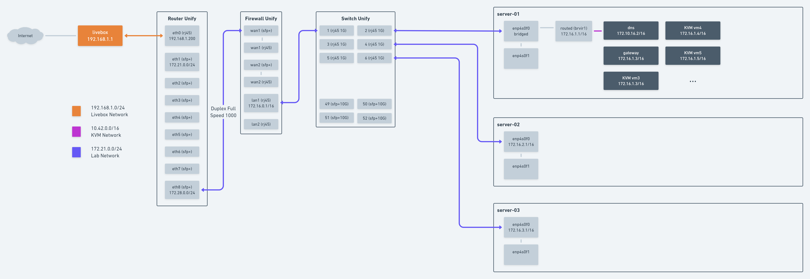
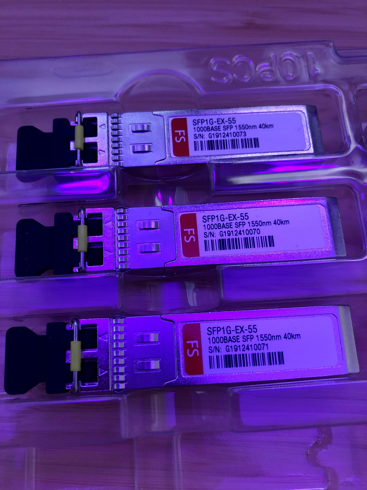

# Présentation

## Sommaire







## Vue du réseau final

Le réseau à plusieurs spécificité, dans un premier temps le réseau extérieur arrive d'une Livebox \(seul FAI disponible\).

Nous avons ensuite un **Router EdgeRouter Infinity** `ER-8-XG-EU` de chez Ubiquiti qui est configuré sur la Livebox en IP statique `192.168.1.200`. Une fois cela fait, le router est mis en DMZ de la Livebox afin d'avoir la main sur le réseau. Je ne me sert de la Livebox que en tant que ISP. La box est connecté via un câble **RJ45 Cat7 10G** sur le port RJ45 eth0 du Router avec un **Module SFP+ RJ45 10G**.

Ensuite viens la partie interne du réseau, dans le port eth8 \(qui est un port SFP+\) j'ai utilisé un link 1G avec des modules 1G. J'aurais pu utiliser des modules 10G mais tout le reste du network est en 1G, donc le lien aurait pas eu une grande importance.

Les modules sont ensuite interconnecté avec une fibre en Single Mode LC/LC Duplex

Nous arrivons donc au firewall qui est lui un **UniFi Security Gateway Pro**`USG-PRO-4-EU` sur le port SFP+ WAN1. De l'autre coté, nous sortons sur le port LAN1 pour redispatche le réseau local sur un switch **UniFi Switch PRO 48**`USW-Pro-48-EU`.

En ce qui concerne les serveurs ce sont tous des **SuperMicro 6028R-TRT** 

<table>
  <thead>
    <tr>
      <th style="text-align:left">Server Name</th>
      <th style="text-align:left">CPU</th>
      <th style="text-align:left">RAM</th>
      <th style="text-align:left">Disks</th>
    </tr>
  </thead>
  <tbody>
    <tr>
      <td style="text-align:left">server-01</td>
      <td style="text-align:left">2x Xeon E5-2673v3 12-Core 2.40 GHz</td>
      <td style="text-align:left">256 Gb</td>
      <td style="text-align:left">
        
2x 600 GB SAS 15K

        
2x IronWolf Pro 14 TB SATA 7.2K

      </td>
    </tr>
    <tr>
      <td style="text-align:left">server-02</td>
      <td style="text-align:left">2x Xeon E5-2673v3 12-Core 2.40 GHz</td>
      <td style="text-align:left">16 Gb</td>
      <td style="text-align:left">2x 600 GB SAS 15K</td>
    </tr>
    <tr>
      <td style="text-align:left">server-03</td>
      <td style="text-align:left">2x Xeon E5-2673v3 12-Core 2.40 GHz</td>
      <td style="text-align:left">16 Gb</td>
      <td style="text-align:left">2x 600 GB SAS 15K</td>
    </tr>
  </tbody>
</table>

